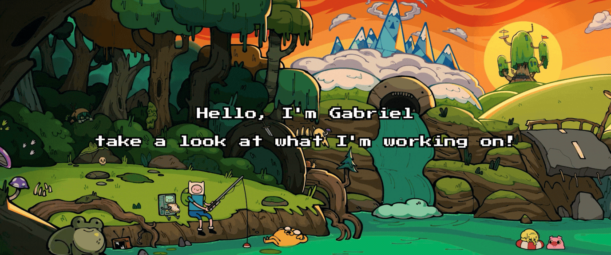

  
  
  

<h3>Welcome! <a href="./assets/quoteSnail.gif"> </h3> </a>

  I'm an aspiring Full Stack Developer currently focusing on mastering data structures, algorithms, and core web technologies. I thrive on collaborative projects where I can apply my knowledge in front-end, back-end, and cloud infrastructure to deliver impactful solutions.

  

    📍 <b>Location:</b> São Paulo, Brasil 
    🎓 <b>Education:</b> System Development Student at Senac 
    🎯 <b>Focus:</b> Improving my command of Full Stack technologies and Software Architecture.
  

  
  ## ⚙️ Tech Stack

💻 Languages & Frameworks

 
  

🛠️ Databases & Tools

 

## 📌 Pinned Repositories 

<a href="https://github.com/STeam-PI/Roupas_Angular-PI">
  <picture>
    <source media="(prefers-color-scheme: dark)" 
            srcset="https://github-readme-stats-six-sigma-41.vercel.app/api/pin/?username=STeam-PI&repo=Roupas_Angular-PI&bg_color=1A2B34&title_color=00CCFF&text_color=c9cacc&icon_color=00CCFF&show_icons=true&border_radius=15&border_color=79E6D9"/>
    
  </picture>
</a>

<a href="https://github.com/jovemOG-Dev/BR-Turismo">
  <picture>
    <source media="(prefers-color-scheme: dark)" 
            srcset="https://github-readme-stats-six-sigma-41.vercel.app/api/pin?username=jovemOG-Dev&repo=BR-Turismo&title_color=FAEC1F&text_color=c9cacc&icon_color=FAEC1F&bg_color=454509&border_color=FFB000&border_radius=15"/>
    
  </picture>
</a>

## &#x1f4c8; GitHub Stats

<a href="https://github.com/jovemOG-Dev?tab=repositories">
  <picture>
    <source media="(prefers-color-scheme: dark)" 
            srcset="https://github-readme-stats-six-sigma-41.vercel.app/api/top-langs/?username=jovemOG-Dev&layout=normal&bg_color=3D002B&title_color=FF91D7&text_color=FFFFFF&border_radius=15&border_color=FF00CC&hide=Jupyter+Notebook,Shell&langs_count=6&cache_seconds=0" />
    
  </picture>
</a>

<a href="https://github.com/jovemOG-Dev/">
  <picture>
    <source media="(prefers-color-scheme: dark)" 
            srcset="https://github-readme-stats-six-sigma-41.vercel.app/api?username=jovemOG-Dev&show_icons=true&bg_color=070c20&title_color=505c76&text_color=FFFFFF&icon_color=5b1d2c&border_radius=15&border_color=5b1d2c&card_width=400" />
    
  </picture>
</a>

  

